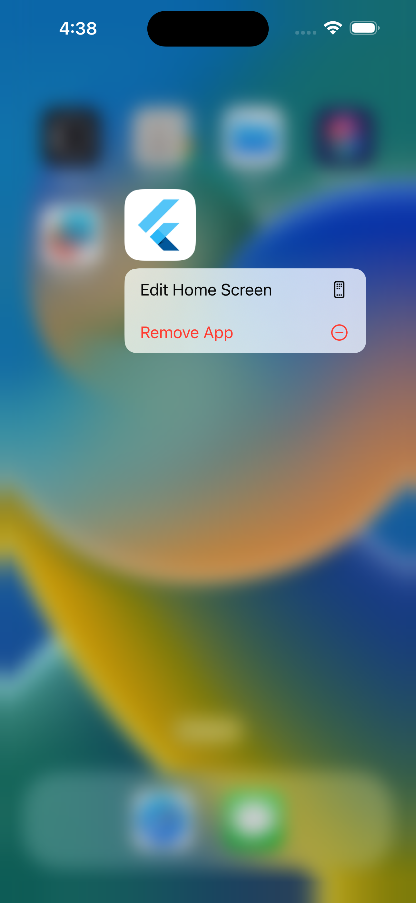
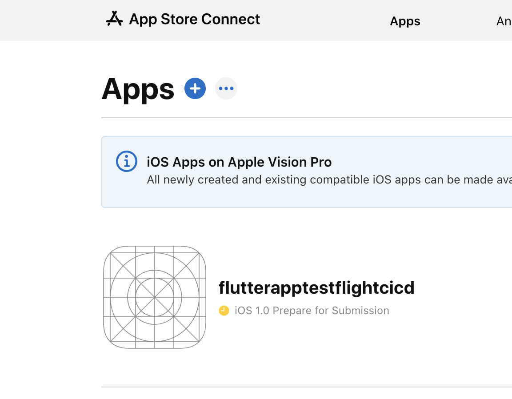
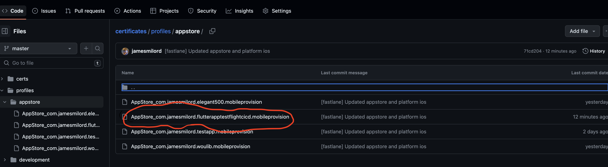
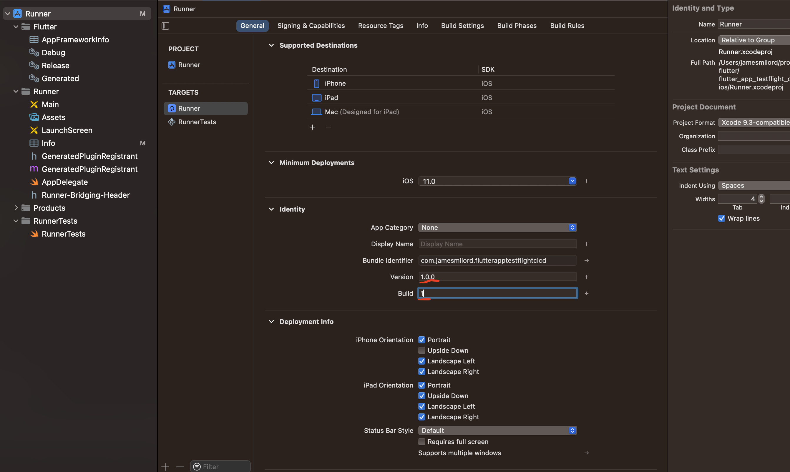
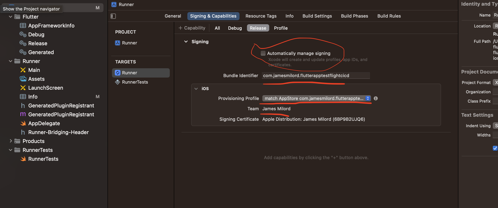
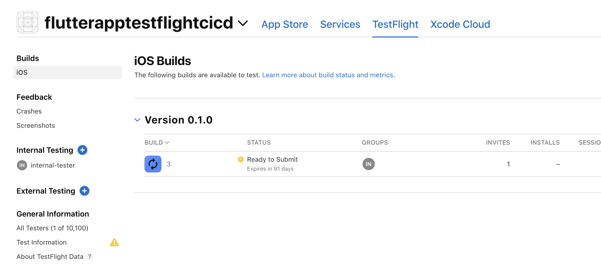
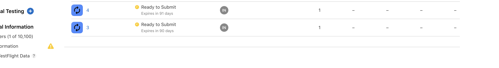

# Flutter App CI/CD to TestFlight


This repository serves as a demonstration of setting up continuous integration and continuous deployment (CI/CD) for a Flutter app called "flutter_app_testflight_cicd" to deploy it to TestFlight. With this CI/CD setup, your Flutter app can be automatically deployed to TestFlight for beta testing.

## Overview

In this repository, we showcase how to automate the deployment process of a Flutter app to TestFlight using Fastlane and a CI/CD service. The setup includes:

- Configuring Fastlane for iOS app deployment.
- Setting up a CI/CD pipeline to trigger deployments on code changes.
- Automating the upload of your "flutter_app_testflight_cicd" app to TestFlight.

Follow the steps below to get started with the CI/CD setup.

## Prerequisites

Before you begin, ensure you have the following prerequisites:

- Flutter Installed on your machine.
- A Flutter app that you want to deploy.
- An active Apple Developer account.
- Fastlane installed on your local development machine.
- A CI/CD service (e.g., GitHub Actions, Bitrise, CircleCI) integrated with your GitHub repository.

## Getting Started

1. **App creation**: Start by creating a new app on your local machine (here I named the app flutter_app_testflight_cicd, but you can name it whatever you want).

   ```shell
   flutter create flutter_app_testflight_cicd -e
   cd flutter_app_testflight_cicd

The -e flag means **empty** , since I am trying to keep this demo simple. This will create a simple hello world app.
- Now lets ensure we can run our app (here I will use ios simulator but you can pick any simulator you want)

    ```shell
    flutter pub get
    flutter run

you should see something like this 


Next let add some finishing touches on our app to get it ready for build and release.

First lets find an icon for our app. I like to use [Icon Kitchen](https://icon.kitchen/). Choose an icon, then download. Save the generated `play_store_512.png` file in a root folder called assets (here I renamed it app_logo).

Now that we have an icon for our app, lets use it. We will use the following package s[flutter_launcher_icons](https://pub.dev/packages/flutter_launcher_icons) which simplifies the task of updating your Flutter app's launcher icon, and [rename](https://pub.dev/packages/rename) which helps you to change your flutter project's AppName and BundleId for different platform.

Let add flutter_launcher_icons to our `pubspec.yaml`

```
    flutter_launcher_icons: "^0.13.1"

    flutter_launcher_icons:
        android: true
        ios: true
        image_path: "assets/app_logo.png"
```


run `flutter pub get` to update the dependencies.

Now let set our launcher icon.

```
flutter clean && flutter pub run flutter_launcher_icons:main
```

You should see the following output

```
Cleaning Xcode workspace...                                      1,575ms
Cleaning Xcode workspace...                                      1,801ms
Deleting build...                                                    9ms
Deleting .dart_tool...                                               1ms
Deleting Generated.xcconfig...                                       0ms
Deleting flutter_export_environment.sh...                            0ms
Deleting ephemeral...                                                0ms
Deprecated. Use `dart run` instead.
Resolving dependencies... 
Got dependencies.
Building package executable... (1.5s)
Built flutter_launcher_icons:main.
This command is deprecated and replaced with "flutter pub run flutter_launcher_icons"
  ════════════════════════════════════════════
     FLUTTER LAUNCHER ICONS (v0.13.1)                               
  ════════════════════════════════════════════
  
• Creating default icons Android
• Overwriting the default Android launcher icon with a new icon

WARNING: Icons with alpha channel are not allowed in the Apple App Store.
Set "remove_alpha_ios: true" to remove it.

• Overwriting default iOS launcher icon with new icon
No platform provided

✓ Successfully generated launcher icons
```

Now remove the app from the simulator


and rerun 
```
flutter run
```

You should see the flutter icon being replaced by the new `app_logo.png` file.


Tired already??? we still have a few things to do.

Now remember the rename package `rename`, we need to add this globally with the following command.

```
flutter pub global activate rename
```

Then we need to rename our app to make sure its more human friendly (and not camelcase).

run 

```
flutter pub global run rename --appname "Flutter app TestFlight cicd"
```

You should see this output 

```
┌───────────────────────────────────────────────────────────────────────────────────────────────────────────────────────
│ #0   FileRepository.changeIosAppName (package:rename/file_repository.dart:251:12)
│ #1   <asynchronous suspension>
├┄┄┄┄┄┄┄┄┄┄┄┄┄┄┄┄┄┄┄┄┄┄┄┄┄┄┄┄┄┄┄┄┄┄┄┄┄┄┄┄┄┄┄┄┄┄┄┄┄┄┄┄┄┄┄┄┄┄┄┄┄┄┄┄┄┄┄┄┄┄┄┄┄┄┄┄┄┄┄┄┄┄┄┄┄┄┄┄┄┄┄┄┄┄┄┄┄┄┄┄┄┄┄┄┄┄┄┄┄┄┄┄┄┄┄┄┄┄┄
│ 💡 IOS appname changed successfully to : Flutter app TestFlight cicd
└───────────────────────────────────────────────────────────────────────────────────────────────────────────────────────
┌───────────────────────────────────────────────────────────────────────────────────────────────────────────────────────
│ #0   FileRepository.changeMacOsAppName (package:rename/file_repository.dart:276:12)
│ #1   <asynchronous suspension>
├┄┄┄┄┄┄┄┄┄┄┄┄┄┄┄┄┄┄┄┄┄┄┄┄┄┄┄┄┄┄┄┄┄┄┄┄┄┄┄┄┄┄┄┄┄┄┄┄┄┄┄┄┄┄┄┄┄┄┄┄┄┄┄┄┄┄┄┄┄┄┄┄┄┄┄┄┄┄┄┄┄┄┄┄┄┄┄┄┄┄┄┄┄┄┄┄┄┄┄┄┄┄┄┄┄┄┄┄┄┄┄┄┄┄┄┄┄┄┄
│ 💡 MacOS appname changed successfully to : Flutter app TestFlight cicd
└───────────────────────────────────────────────────────────────────────────────────────────────────────────────────────
┌───────────────────────────────────────────────────────────────────────────────────────────────────────────────────────
│ #0   FileRepository.changeAndroidAppName (package:rename/file_repository.dart:301:12)
│ #1   <asynchronous suspension>
├┄┄┄┄┄┄┄┄┄┄┄┄┄┄┄┄┄┄┄┄┄┄┄┄┄┄┄┄┄┄┄┄┄┄┄┄┄┄┄┄┄┄┄┄┄┄┄┄┄┄┄┄┄┄┄┄┄┄┄┄┄┄┄┄┄┄┄┄┄┄┄┄┄┄┄┄┄┄┄┄┄┄┄┄┄┄┄┄┄┄┄┄┄┄┄┄┄┄┄┄┄┄┄┄┄┄┄┄┄┄┄┄┄┄┄┄┄┄┄
│ 💡 Android appname changed successfully to : Flutter app TestFlight cicd
└───────────────────────────────────────────────────────────────────────────────────────────────────────────────────────
┌───────────────────────────────────────────────────────────────────────────────────────────────────────────────────────
│ #0   FileRepository.changeLinuxAppName (package:rename/file_repository.dart:353:12)
│ #1   <asynchronous suspension>
├┄┄┄┄┄┄┄┄┄┄┄┄┄┄┄┄┄┄┄┄┄┄┄┄┄┄┄┄┄┄┄┄┄┄┄┄┄┄┄┄┄┄┄┄┄┄┄┄┄┄┄┄┄┄┄┄┄┄┄┄┄┄┄┄┄┄┄┄┄┄┄┄┄┄┄┄┄┄┄┄┄┄┄┄┄┄┄┄┄┄┄┄┄┄┄┄┄┄┄┄┄┄┄┄┄┄┄┄┄┄┄┄┄┄┄┄┄┄┄
│ 💡 Linux appname changed successfully to : Flutter app TestFlight cicd
└───────────────────────────────────────────────────────────────────────────────────────────────────────────────────────
┌───────────────────────────────────────────────────────────────────────────────────────────────────────────────────────
│ #0   FileRepository.changeWebAppName (package:rename/file_repository.dart:409:12)
│ #1   <asynchronous suspension>
├┄┄┄┄┄┄┄┄┄┄┄┄┄┄┄┄┄┄┄┄┄┄┄┄┄┄┄┄┄┄┄┄┄┄┄┄┄┄┄┄┄┄┄┄┄┄┄┄┄┄┄┄┄┄┄┄┄┄┄┄┄┄┄┄┄┄┄┄┄┄┄┄┄┄┄┄┄┄┄┄┄┄┄┄┄┄┄┄┄┄┄┄┄┄┄┄┄┄┄┄┄┄┄┄┄┄┄┄┄┄┄┄┄┄┄┄┄┄┄
│ 💡 Web appname changed successfully to : Flutter app TestFlight cicd
└───────────────────────────────────────────────────────────────────────────────────────────────────────────────────────
┌───────────────────────────────────────────────────────────────────────────────────────────────────────────────────────
│ #0   FileRepository.changeWindowsAppName (package:rename/file_repository.dart:418:12)
│ #1   <asynchronous suspension>
├┄┄┄┄┄┄┄┄┄┄┄┄┄┄┄┄┄┄┄┄┄┄┄┄┄┄┄┄┄┄┄┄┄┄┄┄┄┄┄┄┄┄┄┄┄┄┄┄┄┄┄┄┄┄┄┄┄┄┄┄┄┄┄┄┄┄┄┄┄┄┄┄┄┄┄┄┄┄┄┄┄┄┄┄┄┄┄┄┄┄┄┄┄┄┄┄┄┄┄┄┄┄┄┄┄┄┄┄┄┄┄┄┄┄┄┄┄┄┄
│ 💡 Windows appname changed successfully to : Flutter app TestFlight cicd
```

And also lets update the bundleId

run 

```
 flutter pub global run rename --bundleId com.jamesmilord.flutterapptestflightcicd
```

You should see the following 

```
┌───────────────────────────────────────────────────────────────────────────────────────────────────────────────────────
│ #0   FileRepository.changeIosBundleId (package:rename/file_repository.dart:90:12)
│ #1   <asynchronous suspension>
├┄┄┄┄┄┄┄┄┄┄┄┄┄┄┄┄┄┄┄┄┄┄┄┄┄┄┄┄┄┄┄┄┄┄┄┄┄┄┄┄┄┄┄┄┄┄┄┄┄┄┄┄┄┄┄┄┄┄┄┄┄┄┄┄┄┄┄┄┄┄┄┄┄┄┄┄┄┄┄┄┄┄┄┄┄┄┄┄┄┄┄┄┄┄┄┄┄┄┄┄┄┄┄┄┄┄┄┄┄┄┄┄┄┄┄┄┄┄┄
│ 💡 IOS BundleIdentifier changed successfully to : com.jamesmilord.flutterapptestflightcicd
└───────────────────────────────────────────────────────────────────────────────────────────────────────────────────────
┌───────────────────────────────────────────────────────────────────────────────────────────────────────────────────────
│ #0   FileRepository.changeMacOsBundleId (package:rename/file_repository.dart:132:12)
│ #1   <asynchronous suspension>
├┄┄┄┄┄┄┄┄┄┄┄┄┄┄┄┄┄┄┄┄┄┄┄┄┄┄┄┄┄┄┄┄┄┄┄┄┄┄┄┄┄┄┄┄┄┄┄┄┄┄┄┄┄┄┄┄┄┄┄┄┄┄┄┄┄┄┄┄┄┄┄┄┄┄┄┄┄┄┄┄┄┄┄┄┄┄┄┄┄┄┄┄┄┄┄┄┄┄┄┄┄┄┄┄┄┄┄┄┄┄┄┄┄┄┄┄┄┄┄
│ 💡 MacOS BundleIdentifier changed successfully to : com.jamesmilord.flutterapptestflightcicd
└───────────────────────────────────────────────────────────────────────────────────────────────────────────────────────
┌───────────────────────────────────────────────────────────────────────────────────────────────────────────────────────
│ #0   FileRepository.changeAndroidBundleId (package:rename/file_repository.dart:175:12)
│ #1   <asynchronous suspension>
├┄┄┄┄┄┄┄┄┄┄┄┄┄┄┄┄┄┄┄┄┄┄┄┄┄┄┄┄┄┄┄┄┄┄┄┄┄┄┄┄┄┄┄┄┄┄┄┄┄┄┄┄┄┄┄┄┄┄┄┄┄┄┄┄┄┄┄┄┄┄┄┄┄┄┄┄┄┄┄┄┄┄┄┄┄┄┄┄┄┄┄┄┄┄┄┄┄┄┄┄┄┄┄┄┄┄┄┄┄┄┄┄┄┄┄┄┄┄┄
│ 💡 Android bundleId changed successfully to : com.jamesmilord.flutterapptestflightcicd
└───────────────────────────────────────────────────────────────────────────────────────────────────────────────────────
┌───────────────────────────────────────────────────────────────────────────────────────────────────────────────────────
│ #0   FileRepository.changeLinuxBundleId (package:rename/file_repository.dart:218:12)
│ #1   <asynchronous suspension>
├┄┄┄┄┄┄┄┄┄┄┄┄┄┄┄┄┄┄┄┄┄┄┄┄┄┄┄┄┄┄┄┄┄┄┄┄┄┄┄┄┄┄┄┄┄┄┄┄┄┄┄┄┄┄┄┄┄┄┄┄┄┄┄┄┄┄┄┄┄┄┄┄┄┄┄┄┄┄┄┄┄┄┄┄┄┄┄┄┄┄┄┄┄┄┄┄┄┄┄┄┄┄┄┄┄┄┄┄┄┄┄┄┄┄┄┄┄┄┄
│ 💡 Linux BundleIdentifier changed successfully to : com.jamesmilord.flutterapptestflightcicd
└───────────────────────────────────────────────────────────────────────────────────────────────────────────────────────
```

Lets delete rerun the app to make sure we see the changes reflected (so we don t have two app in the simulator since we changed the appname and bundle id)

```
flutter run
```

If you look at the `info.plist` file in the `ios/Runner` folder you should see the `CFBundleName` updated to the new appname you added with `rename` and new bundle id can also be seen in `project.pbxproj` file in `Runner.xcodeproj` folder.


2. **Fastlane setup**

Change directory into `/ios`, then run 

```
fastlane init
```

You will see the following output

```
[✔] 🚀 
[✔] Looking for iOS and Android projects in current directory...
[05:12:49]: Created new folder './fastlane'.
[05:12:49]: Detected an iOS/macOS project in the current directory: 'Runner.xcworkspace'
[05:12:49]: -----------------------------
[05:12:49]: --- Welcome to fastlane 🚀 ---
[05:12:49]: -----------------------------
[05:12:49]: fastlane can help you with all kinds of automation for your mobile app
[05:12:49]: We recommend automating one task first, and then gradually automating more over time
[05:12:49]: What would you like to use fastlane for?
1. 📸  Automate screenshots
2. 👩‍✈️  Automate beta distribution to TestFlight
3. 🚀  Automate App Store distribution
4. 🛠  Manual setup - manually setup your project to automate your tasks
?  2
```

Here I selected option `2` since I want to push to testflight. Hit enter after you selection you will see the following output

```
[05:13:53]: -----------------------------------------------------------
[05:13:53]: --- Setting up fastlane for iOS TestFlight distribution ---
[05:13:53]: -----------------------------------------------------------
[05:13:53]: Parsing your local Xcode project to find the available schemes and the app identifier
[05:13:53]: Resolving Swift Package Manager dependencies...
[05:13:53]: $ xcodebuild -resolvePackageDependencies -workspace Runner.xcworkspace -scheme Runner
[05:13:54]: ▸ 2023-09-19 05:13:54.536 xcodebuild[94782:3296295] DVTCoreDeviceEnabledState: DVTCoreDeviceEnabledState_Disabled set via user default (DVTEnableCoreDevice=disabled)
[05:13:54]: ▸ Command line invocation:
[05:13:54]: ▸     /Applications/Xcode.app/Contents/Developer/usr/bin/xcodebuild -resolvePackageDependencies -workspace Runner.xcworkspace -scheme Runner
[05:13:54]: ▸ User defaults from command line:
[05:13:54]: ▸     IDEPackageSupportUseBuiltinSCM = YES
[05:13:54]: ▸ resolved source packages: 
[05:13:54]: $ xcodebuild -showBuildSettings -workspace Runner.xcworkspace -scheme Runner
2023-09-19 05:13:55.050 xcodebuild[94785:3296356] DVTCoreDeviceEnabledState: DVTCoreDeviceEnabledState_Disabled set via user default (DVTEnableCoreDevice=disabled)
2023-09-19 05:13:55.743 xcodebuild[94785:3296470] Requested but did not find extension point with identifier Xcode.InterfaceBuilderBuildSupport.PlatformDefinition
[05:13:55]: $ cd /Users/jamesmilord/projects/flutter/flutter_app_testflight_cicd/ios && agvtool what-version -terse
[05:13:56]: ▸ "$(FLUTTER_BUILD_NUMBER)"
[05:13:56]: ▸ 1
[05:13:56]: --------------------------------
[05:13:56]: --- Login with your Apple ID ---
[05:13:56]: --------------------------------
[05:13:56]: To use App Store Connect and Apple Developer Portal features as part of fastlane,
[05:13:56]: we will ask you for your Apple ID username and password
[05:13:56]: This is necessary for certain fastlane features, for example:
[05:13:56]: 
[05:13:56]: - Create and manage your provisioning profiles on the Developer Portal
[05:13:56]: - Upload and manage TestFlight and App Store builds on App Store Connect
[05:13:56]: - Manage your App Store Connect app metadata and screenshots
[05:13:56]: 
[05:13:56]: Your Apple ID credentials will only be stored in your Keychain, on your local machine
[05:13:56]: For more information, check out
[05:13:56]:     https://github.com/fastlane/fastlane/tree/master/credentials_manager
[05:13:56]: 
[05:13:56]: Please enter your Apple ID developer credentials
[05:13:56]: Apple ID Username:
```

Now enter your Apple ID Username (you might also be prompted for the password)

```
[05:13:56]: Please enter your Apple ID developer credentials
[05:13:56]: Apple ID Username:
xxxxxxxx@gmail.com
[05:16:51]: Logging in...
Available session is not valid any more. Continuing with normal login.
[05:16:54]: ✅  Logging in with your Apple ID was successful
[05:16:54]: Checking if the app 'com.jamesmilord.flutterapptestflightcicd' exists in your Apple Developer Portal...
[05:16:55]: It looks like the app 'com.jamesmilord.flutterapptestflightcicd' isn't available on the Apple Developer Portal
[05:16:55]: for the team ID 'xxxxxxx' on Apple ID 'xxxxxxxx@gmail.com'
[05:16:55]: Do you want fastlane to create the App ID for you on the Apple Developer Portal? (y/n)
```

Now we can see that fastlane has not found the app on Apple Developer Portal with the following bundle Id 'com.jamesmilord.flutterapptestflightcicd' it wants to create it for us (this is required), lets allow it. It will also create the app on App Store Connect if not found as well (Fastlane is so useful)

we should have seen the following outputs/prompts by now

```
y

+-----------------------------------------------------------+
|                Summary for produce 2.215.1                |
+----------------+------------------------------------------+
| username       | xxxxxxxxx@gmail.com                  |
| team_id        | 6BP9B2UJQ6                               |
| itc_team_id    | 123124103                                |
| platform       | ios                                      |
| app_identifier | com.jamesmilord.flutterapptestflightcicd |
| skip_itc       | true                                     |
| sku            | 1695115239                               |
| language       | English                                  |
| skip_devcenter | false                                    |
+----------------+------------------------------------------+

[05:20:40]: App Name: flutterapptestflightcicd    
[05:21:16]: Creating new app 'flutterapptestflightcicd' on the Apple Dev Center
[05:21:17]: Created app M9FWB2XN5V
[05:21:17]: Finished creating new app 'flutterapptestflightcicd' on the Dev Center
[05:21:17]: ✅  Successfully created app
[05:21:17]: Checking if the app 'com.jamesmilord.flutterapptestflightcicd' exists on App Store Connect...
[05:21:18]: Looks like the app 'com.jamesmilord.flutterapptestflightcicd' isn't available on App Store Connect
[05:21:18]: for the team ID '123124103' on Apple ID 'xxxxxx@gmail.com'
[05:21:18]: Would you like fastlane to create the App on App Store Connect for you? (y/n)
y

+-----------------------------------------------------------+
|                Summary for produce 2.215.1                |
+----------------+------------------------------------------+
| username       | jamesonelove5@gmail.com                  |
| team_id        | 6BP9B2UJQ6                               |
| itc_team_id    | 123124103                                |
| platform       | ios                                      |
| app_identifier | com.jamesmilord.flutterapptestflightcicd |
| skip_devcenter | true                                     |
| sku            | 1695115387                               |
| language       | English                                  |
| skip_itc       | false                                    |
+----------------+------------------------------------------+

[05:23:09]: App Name: flutterapptestflightcicd
[05:23:22]: Creating new app 'flutterapptestflightcicd' on App Store Connect
[05:23:22]: Sending language name is deprecated. 'English' has been mapped to 'en-US'.
[05:23:22]: Please enter one of available languages: ["ar-SA", "ca", "cs", "da", "de-DE", "el", "en-AU", "en-CA", "en-GB", "en-US", "es-ES", "es-MX", "fi", "fr-CA", "fr-FR", "he", "hi", "hr", "hu", "id", "it", "ja", "ko", "ms", "nl-NL", "no", "pl", "pt-BR", "pt-PT", "ro", "ru", "sk", "sv", "th", "tr", "uk", "vi", "zh-Hans", "zh-Hant"]
[05:23:26]: Ensuring version number
[05:23:26]: Successfully created new app 'flutterapptestflightcicd' on App Store Connect with ID 6466994550
[05:23:26]: ✅  Successfully created app
[05:23:26]: Installing dependencies for you...
[05:23:26]: $ bundle update
[05:23:29]: --------------------------------------------------------
[05:23:29]: --- ✅  Successfully generated fastlane configuration ---
[05:23:29]: --------------------------------------------------------
[05:23:29]: Generated Fastfile at path `./fastlane/Fastfile`
[05:23:29]: Generated Appfile at path `./fastlane/Appfile`
[05:23:29]: Gemfile and Gemfile.lock at path `Gemfile`
[05:23:29]: Please check the newly generated configuration files into git along with your project
[05:23:29]: This way everyone in your team can benefit from your fastlane setup
[05:23:29]: Continue by pressing Enter ⏎

[05:23:37]: fastlane will collect the number of errors for each action to detect integration issues
[05:23:37]: No sensitive/private information will be uploaded, more information: https://docs.fastlane.tools/#metrics
[05:23:37]: ----------------------
[05:23:37]: --- fastlane lanes ---
[05:23:37]: ----------------------
[05:23:37]: fastlane uses a `Fastfile` to store the automation configuration
[05:23:37]: Within that, you'll see different lanes.
[05:23:37]: Each is there to automate a different task, like screenshots, code signing, or pushing new releases
[05:23:37]: Continue by pressing Enter ⏎

[05:23:39]: --------------------------------------
[05:23:39]: --- How to customize your Fastfile ---
[05:23:39]: --------------------------------------
[05:23:39]: Use a text editor of your choice to open the newly created Fastfile and take a look
[05:23:39]: You can now edit the available lanes and actions to customize the setup to fit your needs
[05:23:39]: To get a list of all the available actions, open https://docs.fastlane.tools/actions
[05:23:39]: Continue by pressing Enter ⏎

[05:23:42]: ------------------------------
[05:23:42]: --- Where to go from here? ---
[05:23:42]: ------------------------------
[05:23:42]: 📸  Learn more about how to automatically generate localized App Store screenshots:
[05:23:42]:             https://docs.fastlane.tools/getting-started/ios/screenshots/
[05:23:42]: 👩‍✈️  Learn more about distribution to beta testing services:
[05:23:42]:             https://docs.fastlane.tools/getting-started/ios/beta-deployment/
[05:23:42]: 🚀  Learn more about how to automate the App Store release process:
[05:23:42]:             https://docs.fastlane.tools/getting-started/ios/appstore-deployment/
[05:23:42]: 👩‍⚕️  Learn more about how to setup code signing with fastlane
[05:23:42]:             https://docs.fastlane.tools/codesigning/getting-started/
[05:23:42]: 
[05:23:42]: To try your new fastlane setup, just enter and run
[05:23:42]: $ fastlane beta
```

Finally, Fastlane will generate two files for you — an Appfile and a Fastfile in a folder called `/fastlane` — which you can modify to suit your specific deployment needs.

If you visit the https://appstoreconnect.apple.com/apps you should see



Now since we don t want to accidently push some sensitive values such as keys/token to our version control lets create a `.env` file in the `/ios` folder and add it to gitignore.

Let start with our `Appfile`

which will look like this 

```
app_identifier("com.jamesmilord.flutterapptestflightcicd") # The bundle identifier of your app
apple_id("xxxxxxxxxx@gmail.com") # Your Apple Developer Portal username

itc_team_id("111111111") # App Store Connect Team ID
team_id("aaaaaaaaa12") # Developer Portal Team ID

# For more information about the Appfile, see:
#     https://docs.fastlane.tools/advanced/#appfile

```

let start moving some of those value to the `.env` file.

our `.env` will start looking like this

```
APP_IDENTIFIER=com.jamesmilord.flutterapptestflightcicd
APPLE_ID=xxxxxxxxx@gmail.com
APP_STORE_CONNECT_TEAM_ID=111111111
DEV_PORTAL_TEAM_ID=aaaaaaaaa12
```

and our `Appfile` will look like this 

```
app_identifier(ENV["APP_IDENTIFIER"]) # The bundle identifier of your app
apple_id(ENV["APP_ID"]) # Your Apple Developer Portal username

itc_team_id(ENV["APP_STORE_CONNECT_TEAM_ID"]) # App Store Connect Team ID
team_id(ENV["DEV_PORTAL_TEAM_ID"]) # Developer Portal Team ID

# For more information about the Appfile, see:
#     https://docs.fastlane.tools/advanced/#appfile

```

Before an app can be deployed to the Appstore/Testflight, it needs to be signed. Fastlane has a utility called match that allows us to do that.

Since Match will handle our signing we need a place to store those certificates that will be used for the signing, we will use github for that (other options include s3, etc..).

Lets create private repo called `certificates` (we will need the https url later).

Now let's generate our match file.

run 

```
fastlane match init
```

we will see the following output

```
[05:47:50]: fastlane match supports multiple storage modes, please select the one you want to use:
1. git
2. google_cloud
3. s3
4. gitlab_secure_files
? 1
```
here I selected `1` since I am storing the certificates on Github.

you ll see the following output

```
?  1
[05:49:34]: Please create a new, private git repository to store the certificates and profiles there
[05:49:34]: URL of the Git Repo: 
```
Remember the `certificates` repo https url we talked about earlier. Lets add that as the URL of the Git Repo.

**Note** you can use the certificates for multiple app.

You should see the following output

```
[05:52:29]: Successfully created './fastlane/Matchfile'. You can open the file using a code editor.
[05:52:29]: You can now run `fastlane match development`, `fastlane match adhoc`, `fastlane match enterprise` and `fastlane match appstore`
[05:52:29]: On the first run for each environment it will create the provisioning profiles and
[05:52:29]: certificates for you. From then on, it will automatically import the existing profiles.
[05:52:29]: For more information visit https://docs.fastlane.tools/actions/match/
```

The generated Match file looks like this 

```
git_url("https://github.com/jamesmilord/certificates.git")

storage_mode("git")

type("development") # The default type, can be: appstore, adhoc, enterprise or development

# app_identifier(["tools.fastlane.app", "tools.fastlane.app2"])
# username("user@fastlane.tools") # Your Apple Developer Portal username

# For all available options run `fastlane match --help`
# Remove the # in the beginning of the line to enable the other options

# The docs are available on https://docs.fastlane.tools/actions/match
```

Since we are planning on deploying to the Appstore we need to make one change.

type("development") ---> type("appstore")

And we also need to replace the git url with an env variable so our Match file will look at the end

```
git_url(ENV["GIT_CERTS_URL"])

storage_mode("git")

type("appstore") # The default type, can be: appstore, adhoc, enterprise or development

# app_identifier(["tools.fastlane.app", "tools.fastlane.app2"])
# username("user@fastlane.tools") # Your Apple Developer Portal username

# For all available options run `fastlane match --help`
# Remove the # in the beginning of the line to enable the other options

# The docs are available on https://docs.fastlane.tools/actions/match
```

and our `.env`

```
APP_IDENTIFIER=com.jamesmilord.flutterapptestflightcicd
APPLE_ID=xxxxxxxxx@gmail.com
APP_STORE_CONNECT_TEAM_ID=111111111
DEV_PORTAL_TEAM_ID=aaaaaaaaa12
GIT_CERTS_URL="https://github.com/jamesmilord/certificates.git"
```

Now we need to generate the certificate for our app

let run 

```
fastlane match appstore
```

you should see the following 

```
fastlane beta
[✔] 🚀 
[06:36:12]: ------------------------------
[06:36:12]: --- Step: default_platform ---
[06:36:12]: ------------------------------
[06:36:12]: Driving the lane 'ios beta' 🚀
[06:36:12]: -----------------------------
[06:36:12]: --- Step: delete_keychain ---
[06:36:12]: -----------------------------
[06:36:12]: -----------------------------
[06:36:12]: --- Step: create_keychain ---
[06:36:12]: -----------------------------
[06:36:12]: $ security list-keychains -d user
[06:36:12]: ▸ "/Users/jamesmilord/Library/Keychains/login.keychain-db"
[06:36:12]: ▸ "/Users/jamesmilord/Library/Keychains/tempuser-db"
[06:36:12]: ---------------------------------------
[06:36:12]: --- Step: app_store_connect_api_key ---
[06:36:12]: ---------------------------------------
[06:36:12]: -------------------
[06:36:12]: --- Step: match ---
[06:36:12]: -------------------
[06:36:12]: Successfully loaded '/Users/jamesmilord/projects/flutter/flutter_app_testflight_cicd/ios/fastlane/Matchfile' 📄

+----------------------------------------------------------------+
|          Detected Values from './fastlane/Matchfile'           |
+--------------+-------------------------------------------------+
| git_url      | https://github.com/jamesmilord/certificates.git |
| storage_mode | git                                             |
| type         | appstore                                        |
+--------------+-------------------------------------------------+


+------------------------------------------------------------------------------------------+
|                                Summary for match 2.215.1                                 |
+----------------------------------------+-------------------------------------------------+
| type                                   | appstore                                        |
| app_identifier                         | ["com.jamesmilord.flutterapptestflightcicd"]    |
| git_basic_authorization                | ********                                        |
| readonly                               | true                                            |
| keychain_name                          | test                                            |
| keychain_password                      | ********                                        |
| api_key                                | ********                                        |
| generate_apple_certs                   | true                                            |
| skip_provisioning_profiles             | false                                           |
| team_id                                | 6BP9B2UJQ6                                      |
| storage_mode                           | git                                             |
| git_url                                | https://github.com/jamesmilord/certificates.git |
| git_branch                             | master                                          |
| shallow_clone                          | false                                           |
| clone_branch_directly                  | false                                           |
| skip_google_cloud_account_confirmation | false                                           |
| s3_skip_encryption                     | false                                           |
| gitlab_host                            | https://gitlab.com                              |
| force                                  | false                                           |
| force_for_new_devices                  | false                                           |
| include_mac_in_profiles                | false                                           |
| include_all_certificates               | false                                           |
| force_for_new_certificates             | false                                           |
| skip_confirmation                      | false                                           |
| safe_remove_certs                      | false                                           |
| skip_docs                              | false                                           |
| platform                               | ios                                             |
| derive_catalyst_app_identifier         | false                                           |
| fail_on_name_taken                     | false                                           |
| skip_certificate_matching              | false                                           |
| skip_set_partition_list                | false                                           |
| verbose                                | false                                           |
+----------------------------------------+-------------------------------------------------+

[06:36:12]: Cloning remote git repo...
[06:36:12]: If cloning the repo takes too long, you can use the `clone_branch_directly` option in match.
[06:36:12]: Checking out branch master...
[06:36:12]: 🔓  Successfully decrypted certificates repo
[06:36:12]: Installing certificate...
[06:36:12]: $ security find-certificate -a -c 'Apple Worldwide Developer Relations' -p /Users/jamesmilord/Library/Keychains/login.keychain-db
[06:36:12]: ▸ --
.
.
.
[06:36:13]: All required keys, certificates and provisioning profiles are installed 🙌
[06:36:13]: Setting Provisioning Profile type to 'app-store'
[06:36:13]: -------------------------------
[06:36:13]: --- Step: sync_code_signing ---
[06:36:13]: -------------------------------
[06:36:13]: Successfully loaded '/Users/jamesmilord/projects/flutter/flutter_app_testflight_cicd/ios/fastlane/Matchfile' 📄
```

you should see a new certificate for your app on the certificate repo




Now lets copy the following to our `Fastfile`, I will explain the content of this file later.

```
default_platform(:ios)

TEMP_KEYCHAIN_USER = ENV["TEMP_KEYCHAIN_USER"]
TEMP_KEYCHAIN_PASSWORD = ENV["TEMP_KEYCHAIN_PASSWORD"]
APPLE_KEY_ID = ENV["APPLE_KEY_ID"]
APPLE_ISSUER_ID = ENV["APPLE_ISSUER_ID"]
APPLE_KEY_CONTENT = ENV["APPLE_KEY_CONTENT"]
APP_IDENTIFIER = ENV["APP_IDENTIFIER"]
GIT_AUTHORIZATION = ENV["GIT_AUTHORIZATION"]

def delete_temp_keychain(name)
  delete_keychain(
    name: name
  ) if File.exist? File.expand_path("~/Library/Keychains/#{name}-db")
end

def create_temp_keychain(name, password)
  create_keychain(
    name: name,
    password: password,
    unlock: false,
    timeout: 0
  )
end

def ensure_temp_keychain(name, password)
  delete_temp_keychain(name)
  create_temp_keychain(name, password)
end

platform :ios do
  desc "Push a new beta build to TestFlight"
  lane :beta do
    keychain_name = TEMP_KEYCHAIN_USER
    keychain_password = TEMP_KEYCHAIN_PASSWORD
    ensure_temp_keychain(keychain_name, keychain_password)
    api_key = app_store_connect_api_key(
      key_id: APPLE_KEY_ID,
      issuer_id: APPLE_ISSUER_ID,
      key_content: APPLE_KEY_CONTENT,
      duration: 1200,            
      in_house: false
    )
    match(
      type: 'appstore',
      app_identifier: APP_IDENTIFIER,
      git_basic_authorization: Base64.strict_encode64("#{GIT_AUTHORIZATION}"),
      readonly: true,
      keychain_name: keychain_name,
      keychain_password: keychain_password,
      api_key: api_key
    )
    sync_code_signing
    update_code_signing_settings(
      use_automatic_signing: false,
      path: "Runner.xcodeproj"
    )
    increment_build_number(xcodeproj: "Runner.xcodeproj")
    build_app(workspace: "Runner.xcworkspace", scheme: "Runner")
    update_code_signing_settings(
      use_automatic_signing: true,
      path: "Runner.xcodeproj"
    )
    upload_to_testflight
  end
end

```

At this point if we are reading the content of this file from top to bottom, we see a few env variable set at the top:

TEMP_KEYCHAIN_USER (like the name implied its a temp value, can be any non numeric value)
TEMP_KEYCHAIN_PASSWORD (any non numeric value)
APPLE_KEY_ID (you need to generate a key to allow authentication with Appstore connect, this is the key id)
APPLE_ISSUER_ID (in the keys tab after creating the key you ll find Issuer id at the top )
APPLE_KEY_CONTENT (after creating the key you ll be allow to download it since apple do not store it, after downloading it will look like a private key so in order to use it in a .env file use this command (on mac) `awk -v ORS='\\n' '1' AuthKey_MP99K2TTVS.p8 | pbcopy` this will add it in your clipboard you can ctrl + v to paste it)
APP_IDENTIFIER this is the bundle id in this case its `com.jamesmilord.flutterapptestflightcicd`
GIT_AUTHORIZATION you ll need to create a token to allow repo access for your user to access the certificates repo by `Match`.

The keychain methods after that ensure a temp keychain in created.

The code within `platform :ios` is the beta lane. it will push the app to testflight upon succesful completion of all steps.


3. **Xcode setup**

Now we need to make some change on xcode side of thing. Open the ios folder in xcode (right click + open in xcode)

make sure you set a version and build number (I started mine at 1) you won t have to do this every single time as it will auto update for you.



then switch to the signing & capabilities tab then uncheck the auto signing, make sure to select the right bundle indentifier, the right provisioning profile which should be popuplated and the right team.



3. **Deploy To testflight locally**
we need to test our deployment, we will do it locally first

run 

```
fastlane beta
```
 
🤞 if everything is ok you should see this output

```
[07:05:48]: Successfully distributed build to Internal testers 🚀

+------------------------------------------------+
|                fastlane summary                |
+------+---------------------------+-------------+
| Step | Action                    | Time (in s) |
+------+---------------------------+-------------+
| 1    | default_platform          | 0           |
| 2    | delete_keychain           | 0           |
| 3    | create_keychain           | 0           |
| 4    | app_store_connect_api_key | 0           |
| 5    | match                     | 0           |
| 6    | sync_code_signing         | 2           |
| 7    | automatic_code_signing    | 0           |
| 8    | increment_build_number    | 1           |
| 9    | build_app                 | 38          |
| 10   | automatic_code_signing    | 0           |
| 11   | upload_to_testflight      | 364         |
+------+---------------------------+-------------+

[07:05:48]: fastlane.tools just saved you 7 minutes! 🎉
```

And the app should be in testflight ready to be downloaded by your testers (you will need to add their email to a group first)




3. **Github workflow**

add the following in a workflow file

```
name: Appstore Deployment

on:
  push:
    branches:
      - main
      
jobs:
 deploy_ios:
    name: Deploy build to TestFlight
    runs-on: macOS-latest
    steps:
      - name: Checkout code from ref
        uses: actions/checkout@v3
        with:
          ref: ${{ github.ref }}

      - uses: webfactory/ssh-agent@v0.7.0
        with:
          ssh-private-key: ${{ secrets.MATCH_REPO_KEY }}

      - name: Run Flutter tasks
        uses: subosito/flutter-action@v2
        with:
          flutter-version: '3.13.4'
      - run: flutter clean
      - run: flutter pub get
      - run: flutter build ios --release --no-codesign --no-tree-shake-icons

      - name: Install Ruby
        uses: ruby/setup-ruby@v1
        with:
          ruby-version: '2.7'
          bundler-cache: true
          working-directory: 'ios'

      - name: Deploy iOS Beta to TestFlight via Fastlane
        uses: maierj/fastlane-action@v3.0.0
        with:
          lane: beta
          subdirectory: ios
        env:
          TEMP_KEYCHAIN_USER: ${{ secrets.TEMP_KEYCHAIN_USER }}
          TEMP_KEYCHAIN_PASSWORD: ${{ secrets.TEMP_KEYCHAIN_PASSWORD }}
          APPLE_KEY_ID: ${{ secrets.APPLE_KEY_ID }}
          APPLE_ISSUER_ID: ${{ secrets.APPLE_ISSUER_ID }}
          APP_IDENTIFIER: ${{ secrets.APP_IDENTIFIER }}
          GIT_AUTHORIZATION: ${{ secrets.GIT_AUTHORIZATION }}
          APPLE_KEY_CONTENT: ${{ secrets.APPLE_KEY_CONTENT }}
          APPLE_ID: ${{ secrets.APPLE_ID }}
          APP_STORE_CONNECT_TEAM_ID: ${{ secrets.APP_STORE_CONNECT_TEAM_ID }}
          DEV_PORTAL_TEAM_ID: ${{ secrets.DEV_PORTAL_TEAM_ID }}
          GIT_CERTS_URL: ${{ secrets.GIT_CERTS_URL }}
          MATCH_PASSWORD: ${{ secrets.MATCH_PASSWORD }}
          MATCH_KEYCHAIN_PASSWORD: ${{ secrets.MATCH_KEYCHAIN_PASSWORD }}
```

since developing/pushing to the app store on our local machine is different from doing it on github machines we need to make some small changes. First you will notice the 

```
      - uses: webfactory/ssh-agent@v0.7.0
        with:
          ssh-private-key: ${{ secrets.MATCH_REPO_KEY }}
```

we need to generate a key-pair and add the public key as deploy on the `certificates` repo (make sure to give it read/write access)

then we need to pass the private key as the `MATCH_REPO_KEY` secret.

we also need to change the value for `GIT_CERTS_URL` to be the ssh value instead of https (ex: git@github.com:jamesmilord/certificates.git)

Another important thing is we were developing on a local mac computer. If we look inside our Gemfile.lock in the `/ios` folder we will see 

```
PLATFORMS
  arm64-darwin-22
```

that's the local machine we need to make sure we add whatever machine that we are using in github action so in this case `x86_64-darwin-20`

we can use this command
`bundle lock --add-platform x86_64-darwin-20`

we should see our Gemfile.lock file updated to this 

```
PLATFORMS
  arm64-darwin-22
  x86_64-darwin-20
```

then lets push to github.

Voila!!!

```
[12:13:56]: Waiting for App Store Connect to finish processing the new build (0.1.0 - 4) for IOS
[12:14:28]: Successfully finished processing the build 0.1.0 - 4 for IOS
[12:14:28]: Using App Store Connect's default for notifying external ***ers (which is true) - set `notify_external_***ers` for full control
[12:14:28]: Distributing new build to ***ers: 0.1.0 - 4
[12:14:29]: Export compliance has been set to 'false'. Need to wait for build to finishing processing again...
[12:14:29]: Set 'ITSAppUsesNonExemptEncryption' in the 'Info.plist' to skip this step and speed up the submission
[12:14:30]: Successfully distributed build to Internal ***ers 🚀

+------------------------------------------------+
|                fastlane summary                |
+------+---------------------------+-------------+
| Step | Action                    | Time (in s) |
+------+---------------------------+-------------+
| 1    | default_platform          | 0           |
| 2    | create_keychain           | 0           |
| 3    | app_store_connect_api_key | 0           |
| 4    | match                     | 3           |
| 5    | sync_code_signing         | 4           |
| 6    | automatic_code_signing    | 0           |
| 7    | increment_build_number    | 4           |
| 8    | build_app                 | 92          |
| 9    | automatic_code_signing    | 0           |
| 10   | upload_to_***flight      | 442         |
+------+---------------------------+-------------+

[12:14:30]: fastlane.tools just saved you 9 minutes! 🎉
```

see the build number 4.




